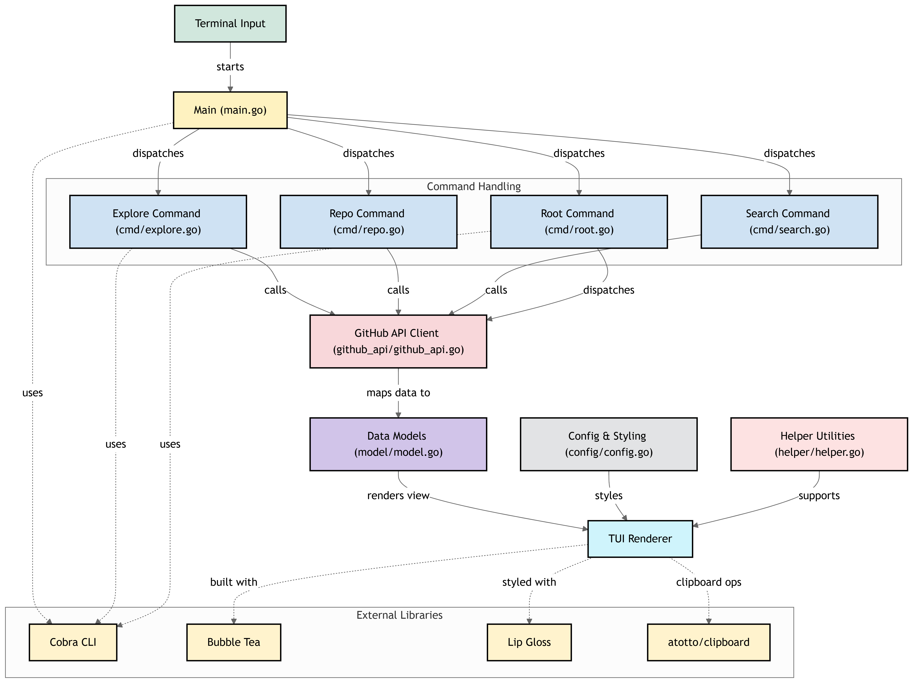

<p align="center">
	<a href="https://github.com/IvanGael/ghexplorer" rel="noopener">
		
	</a>
</p>

<h3 align="center">GitHub Profile Explorer (ghexplorer)</h3>

<div align="center">

[](#)
[](https://golang.org)
[](#)

</div>

---

<p align="center">
Interactive GitHub exploration from your terminal. Browse profiles and repositories in a TUI,
or query repositories directly with CLI commands.
<br>
</p>

## Table of Contents

- [About](#about)
- [Getting Started](#getting_started)
- [Running the tests](#tests)
- [Usage](#usage)
- [Deployment](#deployment)
- [Built Using](#built_using)
- [Authors](#authors)
- [Acknowledgments](#acknowledgement)

## About <a name = "about"></a>

ghexplorer is a Go-based terminal application for exploring GitHub data without leaving your shell. It includes a full-screen interactive TUI for profile exploration and repository navigation, plus focused CLI commands for repository lookup and search.

The project is built on top of Bubble Tea and Cobra, with GitHub API integration for live data access. It is intended for developers who want a fast, keyboard-first workflow to inspect users, repositories, and repository contents.

## 🏁 Getting Started <a name = "getting_started"></a>

These instructions will help you set up ghexplorer on your local machine for development and testing.

### Prerequisites

- Go 1.23 or higher
- Git

```bash
go version
git --version
```

### Installing

Clone the repository and move into the project directory.

```bash
git clone https://github.com/IvanGael/ghexplorer.git
cd ghexplorer
```

Install dependencies.

```bash
go mod download
go mod tidy
```

Build the binary.

```bash
go build -o ghexplorer
```

Run a quick demo by opening the interactive explorer.

```bash
./ghexplorer explore octocat
```

## 🔧 Running the tests <a name = "tests"></a>

Run automated tests for all packages:

```bash
go test ./...
```

### Break down into end to end tests

This project currently focuses on package-level tests around GitHub API behavior. There are no dedicated end-to-end UI tests yet.

```bash
go test ./github_api -v
```

### And coding style tests

Use Go formatting and static analysis checks to keep style and code quality consistent.

```bash
gofmt -w .
go vet ./...
```

## 🎈 Usage <a name="usage"></a>

Start the TUI:

```bash
ghexplorer explore [username]
```

Get repository information:

```bash
ghexplorer repo [username] [repository] --format text
```

Search repositories for a user:

```bash
ghexplorer search [username] [query] --format json --output results.json
```

TUI keyboard shortcuts:

- `Enter`: Select item or open directory
- `Esc`: Go back
- `Tab`: Switch tabs
- `q`: Quit
- `/`: Search repositories

## Deployment <a name = "deployment"></a>

For local deployment on your machine, build and install the binary to your Go bin path:

```bash
go install
```

Optional environment variables:

- `GITHUB_TOKEN`: Increase GitHub API rate limits for heavy usage
- `GITHUB_API_BASE_URL`: Override API base URL for custom GitHub-compatible endpoints

## Built Using <a name = "built_using"></a>

- [Go](https://golang.org/) - Programming language
- [Bubble Tea](https://github.com/charmbracelet/bubbletea) - TUI framework
- [Lip Gloss](https://github.com/charmbracelet/lipgloss) - Terminal styling
- [Cobra](https://github.com/spf13/cobra) - CLI framework
- [GitHub REST API](https://docs.github.com/en/rest) - Data source

## Authors <a name = "authors"></a>

- [@iv4n-ga6l](https://github.com/iv4n-ga6l) - Creator and maintainer

## Acknowledgements <a name = "acknowledgement"></a>

- Bubble Tea and the Charmbracelet ecosystem
- Cobra maintainers
- GitHub API documentation and community examples